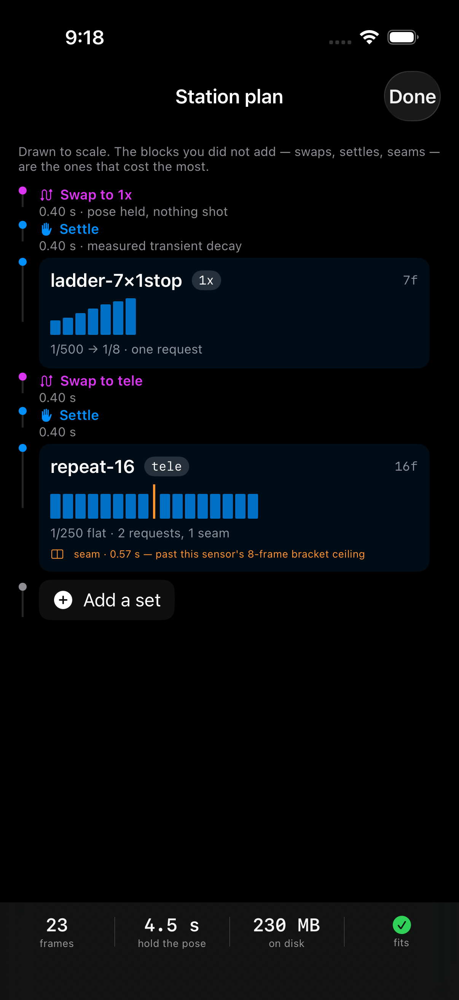
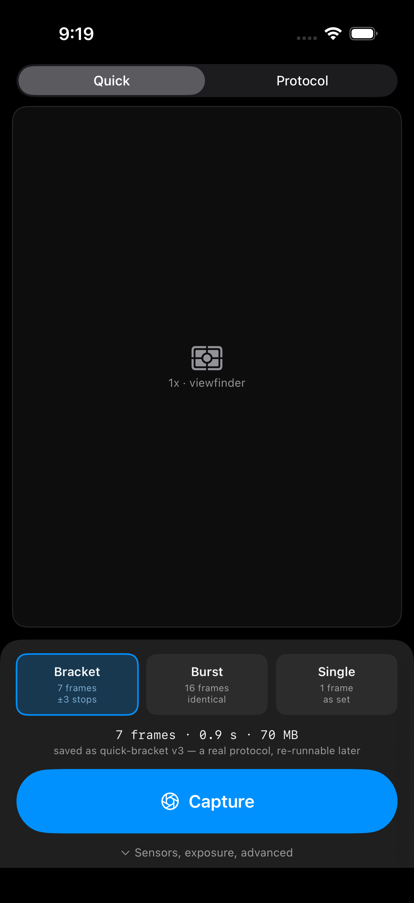
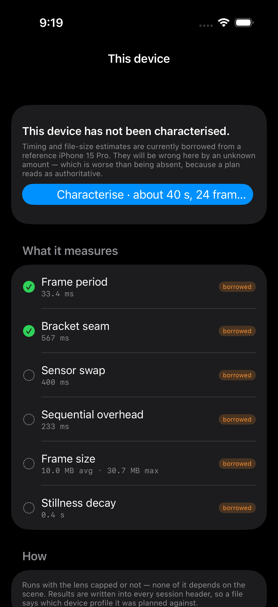
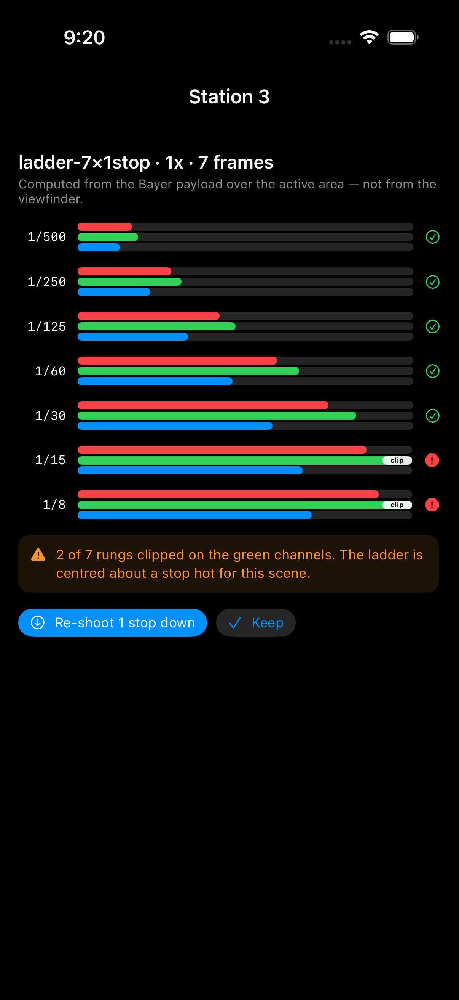

# UI proposals

Four mockups, rendered on a simulator so the proposals can be judged as pictures
rather than paragraphs. They are static views with plausible hardcoded data,
compiled only into debug builds and reachable only through an environment
variable, so none of this can appear in a real run:

```
SIMCTL_CHILD_RAWFORGE_MOCKUP=1 xcrun simctl launch <sim> com.tangericm.rawforge
```

Source: [`app/RAWForge/UI/Mockups.swift`](../../app/RAWForge/UI/Mockups.swift).
Reasoning and phasing: [`docs/roadmap.md`](../roadmap.md).

---

## 1 · The station as a schedule



**The problem.** The shot list is a list, and the timeline is a separate screen
behind it. Those are the same fact split in two — *what* you shoot and *when* it
happens — and the split hides the costs that are easiest to forget, which are
exactly the ones you did not add on purpose.

**The proposal.** Draw the station as a schedule, to scale. Blocks are sized by
duration, so a three-sensor station is visibly mostly *not* shooting. The
ladder's bars are drawn from its own exposures, so a badly-centred sweep looks
wrong before it is shot rather than after. The orange seam marks where a set
crosses the sensor's bracket ceiling.

This is the "blocks-based" idea, but as a **timeline** rather than a node graph.
A node editor would be a second thing to learn; a timeline is the thing you are
already holding a pose against.

---

## 2 · A way in that needs no protocol



**The problem.** A fresh install is a wall. No protocols exist, so the shot list
cannot be built, so no station can be declared, so nothing can be shot until
something has been authored. Correct for the instrument, fatal for adoption —
and a plausible App Store review risk under guideline 4.2.

**The proposal.** Three named intents that expand into real, named, versioned
protocols the moment they fire. Nothing about the record gets weaker: the
provenance requirement is met by generating a genuine protocol rather than by
skipping one. Protocol mode is exactly today's screen.

---

## 3 · Characterising *this* device



**The problem.** Seven timing and file-size constants are measured on one
iPhone 15 Pro. On other hardware they are wrong, and the failure is silent — the
plan still renders and still reads as authoritative. This is the project's own
standard, *a confidently wrong estimate is worse than none*, failing against
itself.

**The proposal.** A ~40 s, scene-independent run that measures all seven on the
device in hand, and labels every value **borrowed** until it has. The app
already knows how to measure them; that is where the numbers came from. The
resulting profile is stamped into each session header, so a file says what it
was planned against.

The community profile list gives a new device decent priors before it measures.
Opt-in, hardware numbers only, contributed by pull request rather than posted to
a server — see the no-backend section of the roadmap.

---

## 4 · Did I clip?



**The problem.** The app already computes a full 16-bit histogram per CFA channel
over the active area of every frame, and displays it as six-decimal numbers in a
list.

**The proposal.** The same numbers as bars. "Did I clip, and where" becomes
readable in about a second — at the pose, while the light is still there, rather
than on a workstation afterwards. Each channel keeps its own colour whether or
not it clipped, with the clip marked at the ceiling; recolouring a clipped bar
red would make "the green channel clipped" unreadable.

Nothing here crosses the no-derived-statistics line: this is the Bayer payload,
not the viewfinder.
